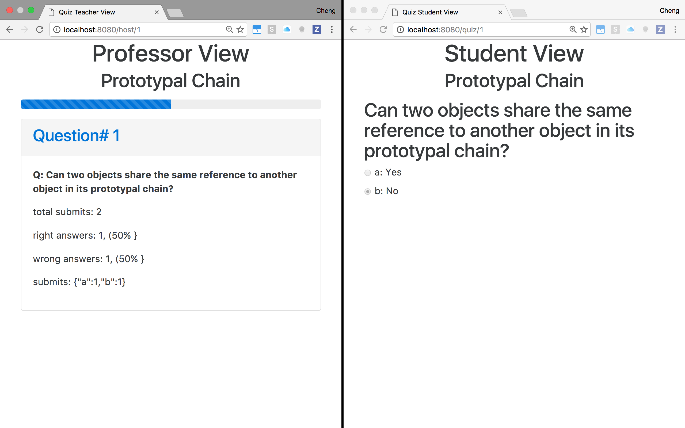

# Classroom Hoster



Classroom hoster is a web application that allows you to host live classroom sessions.
In these classroom sessions, you'll be able to create quizzes in which your students
can join in and take. The results will be fed directly to you to view with stats on the
overall performance of the class.

## Development

```bash
git clone https://github.com/chengsieuly/classroom-hoster.git
npm install
npm start
```

## SQL Server

You will be required to host your own mySQL server. For more info on how to do this, please refer to
[http://dev.mysql.com/doc/refman/5.7/en/](http://dev.mysql.com/doc/refman/5.7/en/).

## Contributing

1. Fork it!
2. Create your feature branch: `git checkout -b my-new-feature`
3. Commit your changes: `git commit -am 'Add some feature'`
4. Push to the branch: `git push origin my-new-feature`
5. Submit a pull request :D

## License

MIT